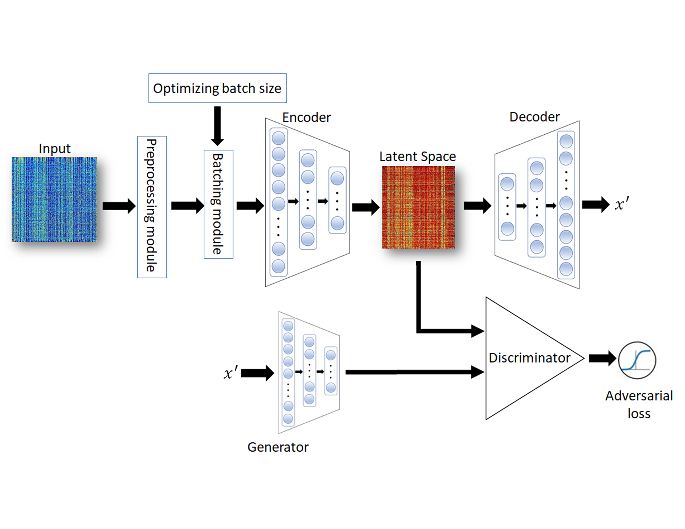

# Schematic of AAE


# Codes

## Enviroment
- Python 3.8
- scanpy 1.9.1
- seaborn 0.12.2
- pandas 1.5.3
- matplotlib 3.6.3
- numpy 1.23.5
- tensorflow 2.11.0
- keras-tuner 1.4.5
- keras 2.15.0
## Installation
### pip

For a traditional Python installation, use
```
$ pip install "$package name"
```
## Usage
### Data processing
- create_sce.R
- collect_data.R
### simulating scRNA Dataset
- generate_sim_data.R
### Data visualization
- figure5_A.py
- figure5_B.py
- sfigure1.R
### Dynamic batching for DB-AAE (db_aae_tuning_example.py)
```python
class AEHyperModel(kt.HyperModel):
  def build(self, hp):
    # Build the encoder / decoder
    encoder = build_encoder(n1,n2,n3,n4,activation)
    decoder = build_decoder(n1,n2,n3,n4,activation)

    # Build and compile the discriminator
    optimizer = RMSprop(learning_rate=0.00002)
    discriminator = build_discriminator(n1,n2,n3,n4,activation)
    discriminator.compile(loss='binary_crossentropy',optimizer=optimizer,metrics=['accuracy'])
    
    autoencoder_input = Input(shape=(n1,))
    reconstructed_input = Input(shape=(n1,))
    encoded_repr = encoder(autoencoder_input)
    reconstructed = decoder(encoded_repr)
    
    # For the adversarial_autoencoder model we will only train the generator
    discriminator.trainable = False

    # The discriminator determines validity of the encoding
    validity = discriminator(encoded_repr)
    

    # The adversarial_autoencoder model  (stacked generator and discriminator)
    adversarial_autoencoder = Model(autoencoder_input, [reconstructed, validity])
    
    adversarial_autoencoder.compile(optimizer=optimizer,loss=['mse', 'binary_crossentropy'],loss_weights=[0.999, 0.001])

    return adversarial_autoencoder
    
    
  def fit(self, hp, adversarial_autoencoder, *args, **kwargs):
    batch_size=hp.Int('batch_size', min_value = 16, max_value = 128, step = 8)
    encoder = build_encoder(n1,n2,n3,n4,activation)
    decoder = build_decoder(n1,n2,n3,n4,activation)
    discriminator = build_discriminator(n1,n2,n3,n4,activation)
    optimizer = RMSprop(learning_rate=0.00002)
    discriminator.compile(loss='binary_crossentropy',optimizer=optimizer,metrics=['accuracy'])
    # For the adversarial_autoencoder model we will only train the generator
    discriminator.trainable = False
    
    valid = np.ones((batch_size, 1))
    fake = np.zeros((batch_size, 1))
    past = datetime.now()
    for epoch in np.arange(1, n_epochs + 1):
        for i in range(int(len(x) / batch_size)):

            # ---------------------
            #  Train Discriminator
            # ---------------------

            # Select a random batch of input matrix
            batch = x[i*batch_size:i*batch_size+batch_size]

    
            latent_fake = encoder.predict(batch)
            latent_real = np.random.normal(size=(batch_size, latent_dim))

            # Train the discriminator
            d_loss_real = discriminator.train_on_batch(latent_real, valid)
            d_loss_fake = discriminator.train_on_batch(latent_fake, fake)
            d_loss = 0.5 * np.add(d_loss_real, d_loss_fake)

            # ---------------------
            #  Train Generator
            # ---------------------

            # Train the generator
            g_loss = adversarial_autoencoder.train_on_batch(batch, [batch, valid])
       
    return 100*d_loss[1]
```
